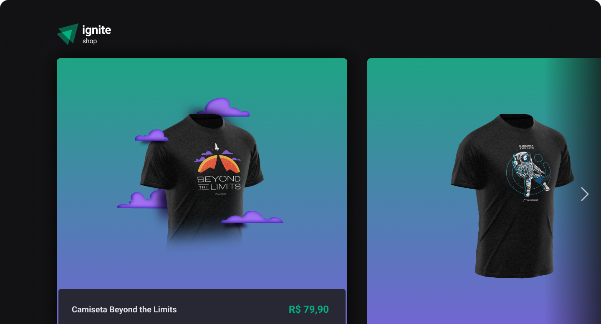

<h4 align="center">

</h4>

<h4 align="center">
    <p align="center">
      <a href="#-about">About</a>&nbsp;&nbsp;&nbsp;|&nbsp;&nbsp;&nbsp;
      <a href="#-technologies">Technologies</a>&nbsp;&nbsp;&nbsp;|&nbsp;&nbsp;&nbsp;
      <a href="#-how-to-run-the-project">Run</a>&nbsp;&nbsp;&nbsp;|&nbsp;&nbsp;&nbsp;
      <a href="#-info">Info</a>&nbsp;&nbsp;&nbsp;|&nbsp;&nbsp;&nbsp;
      <a href="#-license">License</a>
  </p>
</h4>

<h1 align="center">
  
</h1>

## 🔖 About

O **Ignite shop** é um projeto desenvolvido com NextJS.
Com a finalidade aprender com conceitos de SSR e SSG.

Com esse projeto é possível:

- Consumir a API do Stripe;
- Simular a venda de produto através do Stripe;
- Listar produtos cadastrados no Stripe;

O layout está disponível no [Figma](https://www.figma.com/file/OIJJEW24DFiJO6XLqHw2DM/Ignite-Shop/duplicate)

## 🚀 Technologies

- [ReactJS](https://reactjs.org/)
- [TypeScript](https://www.typescriptlang.org/)
- [NextJS](https://nextjs.org/)
- [Stitches](https://stitches.dev/)
- [StripeAPI](https://stripe.com/docs/api)

## 🏁 How to run the project

```bash
# Clone the repository
git clone https://github.com/rafinhaa/ignite-shop.git
cd ignite-shop

# Install the dependencies
npm install

# Copy dotenv file
cp .env.example .env

# Edit dotenv file
vi .env.example .env

# Start the application
npm run dev
```

## ℹ️ Info

## 📝 License
[Detalhes](docs/about)

[MIT](LICENSE)

**Free Software, Hell Yeah!**
